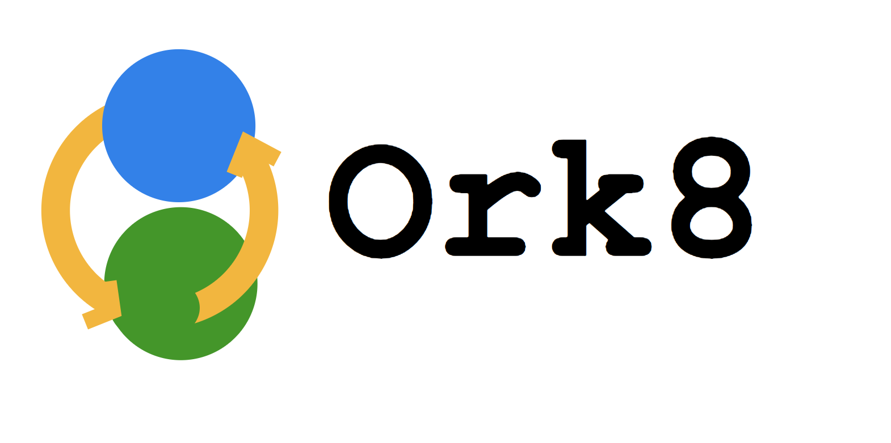

--- 
# Constraints

+++ 
### Linear Workflows (10 yrs ago)
- Teamcity
- Hudson
- Jenkins
+++
## DAGs (Current)
- Airflow
- Luigi
- Azkaban
+++ 
## Other Problems
- No support for proper Input/Output
- Choice of language
- Scheduling / Execution Mix-ups
- App Code Leakage
- No Support for Dynamic Workflows
- Bad UI
- No Streaming Logs / Graphs

+++ 
## Future?
+++

 
---
# Constraint Free 
+++ 
## Proper Input/Output
+++
## Turing Complete Workflows
+++
## Functions could be anywhere
- On-prem machines
- In the cloud
- Serverless functions - lambda / fargate
- Kubernetes etc
+++ 
## Scalable Backend
- Scala
- Akka
- Play
+++
## Nice UI
- React 
- TypeScript
+++
## Well-built out HTTP APIs
+++
## Streaming APIs for logs and graph executions 
 
--- 
# Intro 
+++?image=images/1.png&size=auto 100%
+++?image=images/2.png&size=auto 80%
+++?image=images/3.png&size=auto 80%
+++?image=images/4.png&size=auto 80%
+++?image=images/5.png&size=auto 80%
+++?image=images/6.png&size=auto 80%
+++?image=images/7.png&size=auto 80%
+++?image=images/10.png&size=auto 80%
---
# DAG Execution
+++?image=images/11.png&size=auto 100%
+++?image=images/12.png&size=auto 90%
+++?image=images/13.png&size=auto 100%
---
# Dynamic Execution
+++?image=images/14.png&size=auto 80%
+++?image=images/14.1.png&size=auto 80%
+++?image=images/15.png&size=auto 80%
+++?image=images/16.png&size=auto 80%
+++?image=images/14.1.png&size=auto 80%

+++?image=images/17.png&size=auto 80%

+++
## Solutions

Macros:
```bash
curl -X POST http://localhost:9000/tasks/trigger
{
 "taskId": 2, 
 "parentTaskId": __parentTaskId__ , 
 "parentTaskExecutionId":  __parentTaskExecutionId__
}
```

```bash
curl -X POST http://localhost:9000/tasks/trigger
{
 "taskId": 2, 
 "parentTaskId": 1 , 
 "parentTaskExecutionId": 101
}
```

+++
## Too much context !!
@table[table-header table-fragment text-05](tables/macros.csv)

+++ 
## Solution: SideCar


+++?image=images/sidecar.png&size=auto 80%

---
# Event Driven
+++?image=images/19.png&size=auto 80%
+++?image=images/20.png&size=auto 60%
+++?image=images/21.png&size=auto 80%

--- 
# Scalable Architecture
+++?image=images/18.png&size=auto 80%

--- 
# Demos
+++
# DAG
+++ 
# UI
+++
# Logs 
+++
# Recursion
+++
# Cointoss
+++
# Distributed

---
## Where is Serverless?
+++?image=images/22.png&size=auto 80%
+++?image=images/23.png&size=auto 80%
+++
# Distributed
