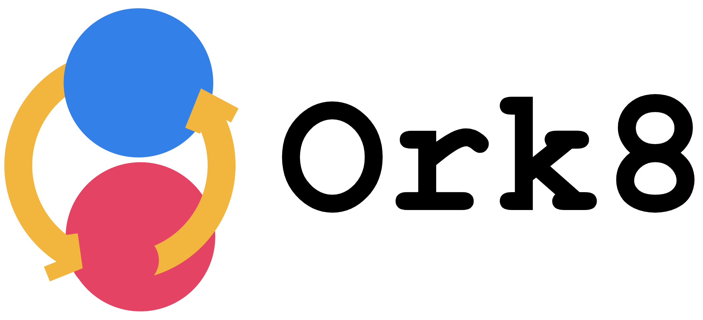

---?image=images/tasks.png&size=auto 100%

---?image=images/dependencies.png&size=auto 100%

---?image=images/flow.png&size=auto 100%

---?image=images/execution-external.png&size=auto 100%

---?image=images/context-problem.png&size=auto 100%

+++
## Solutions

Macros:
```bash
curl -X POST http://localhost:9000/tasks/trigger
{
 "taskId": 2, 
 "parentTaskId": __parentTaskId__ , 
 "parentTaskExecutionId":  __parentTaskExecutionId__
}
```

```bash
curl -X POST http://localhost:9000/tasks/trigger
{
 "taskId": 2, 
 "parentTaskId": 1 , 
 "parentTaskExecutionId": 101
}
```

+++
## Too much context !!
@table[table-header table-fragment text-05](tables/macros.csv)

+++ 
## Solution: SideCar


+++?image=images/sidecar.png&size=auto 100%

--- 
# Features
+++

## Core 
- Outside App
- From WithIn App

+++ 
UI

---
# Flows

## Dynamic
- CoinToss
- MapReduce

## Static
- Dag
- DagWithWait

## Mixed
- Dag
- DagWithWait

---
## IO
- binary
- json
- rpc
- string
- text

---
## Integrations
- datadog
- github
- pagerduty

---
## Deployment
- basic
- docker
- k8s
- lambda

---
## Applications
- ci
- datapipeline
- emr
- jobpipeline
- streaming

--- 
## Clouds
- aws
- azure
- gcp
- onprem

---
## Scale
- MultiAPIMultiWorkers
- SingleAPIMultiWorkers
- SingleAPISingleWorker
- StressTest
